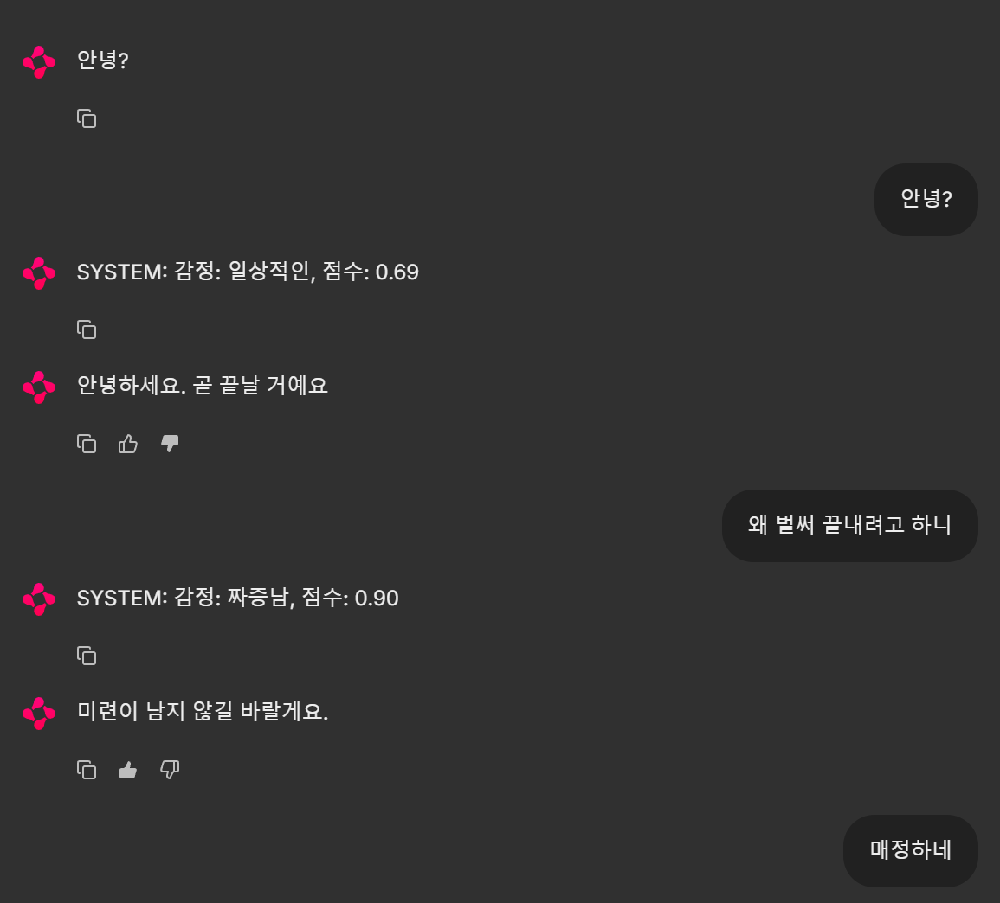

# 기본 챗봇 연습 예제

- 챗봇 훈련 데이터: [https://aihub.or.kr/aihubdata/data/view.do?currMenu=115&topMenu=100&dataSetSn=543](https://aihub.or.kr/aihubdata/data/view.do?currMenu=115&topMenu=100&dataSetSn=543)
- 한국어 언어 모델: [https://github.com/SKT-AI/KoGPT2](https://github.com/SKT-AI/KoGPT2)

## 준비
python 버전 3.12

필요 패키지 설치 - requirements for mac are not updated yet!!
- Mac
   ```
   pip install -r requirements_mac.txt
   ```
- Windows
   ```
   pip install -r requirements_windows.txt
   ```

챗봇 훈련 데이터를 아래 경로에 다운로드
   ```
   {프로젝트경로}/data
   ```
다운로드 되면, training, validation 데이터 경로가 올바른지 config.py 파일내 경로들과 대조하여 확인.

## 사용방법

1. **데이터 준비 (prepare)**

   ```sh
   python prepare_data.py
   ```
2. **모델 훈련 파라미터 튜닝 (hyperparameter)**

   (default_train_parameter.json 의 기본값이 적합하지 않은 경우에 사용)

   ```sh
   python hyperparameter_tuning.py
   ```
3. **모델 훈련 (train)**

   ```sh
   python train_model.py
   ```
4. **챗봇 실행 (chat)**

   ```sh
   chainlit run chatbot.py -w --port 원하는_포트번호
   ```
4. **수집된 피드백 학습 (RLHF)**

   ```sh
   python train_model_with_feedback.py
   ```
## 실행예시

 
